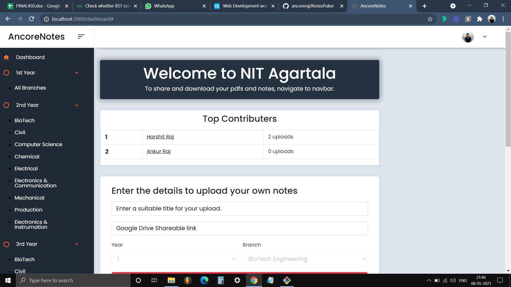
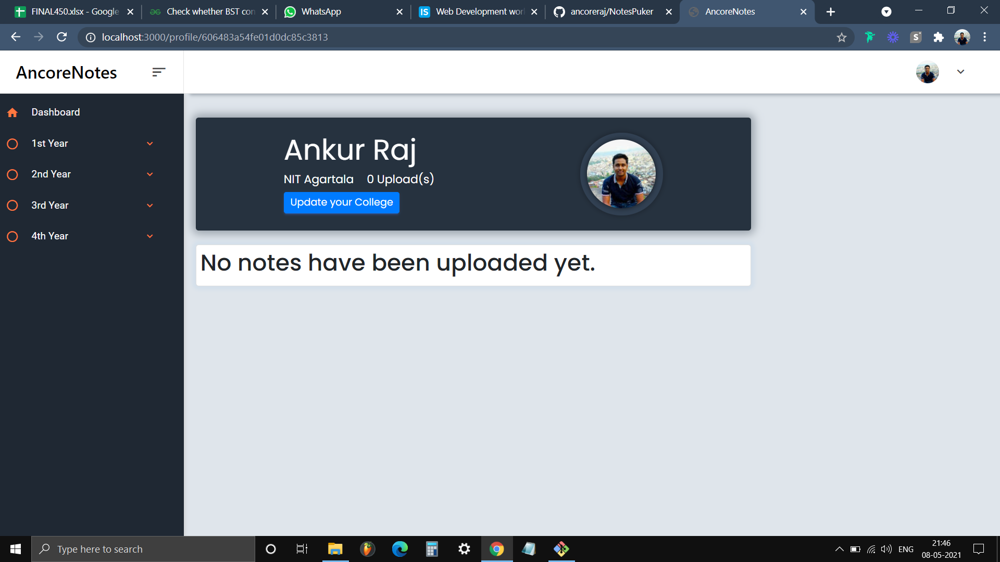
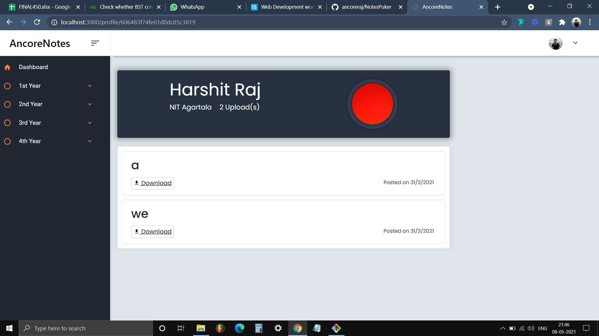

<p align="center">
  <a href="https://ancorenotes.com">
    
  </a>

  <strong>
    <h1 align="center" >AncoreNotes</h1>
  </strong>
 </p>
 
 ## About The Project

- I build this website to help college students pass semester exam easily with the help of notes shared by their topper friends and seniors.
- A SAAS product to upload and share notes/pdf-files to your college friends.
- It has its own environment of sepcific colleges.
- Top liked notes appear at the top of the page.
- Top contributer of a particular college at the top of the dashboard of a sepcific college.
- See notes uploaded by a particular user. 

---
 






### Installation

1. Fork the repo(required), a star is also appretiated but optional :P

2. Clone the forked repo

   ```sh
   git clone https://github.com/{your-github-username}/Notespuker.git
   ```

   example : `git clone https://github.com/ancoreraj/Notespuker.git`

3. Install NPM packages

   ```sh
   npm run install-modules
   ```

4. Start the react and nodejs server concucrrently

   ```sh
   npm run dev
   ```
## Technology Used
### Fronted - Ejs
### Backend - Nodejs
 * ExpressJs - For Routing
 * PassportJs - For Authentication 
 * Mongoose - Relationship between Database(MongoDB)
### Database - MongoDB
